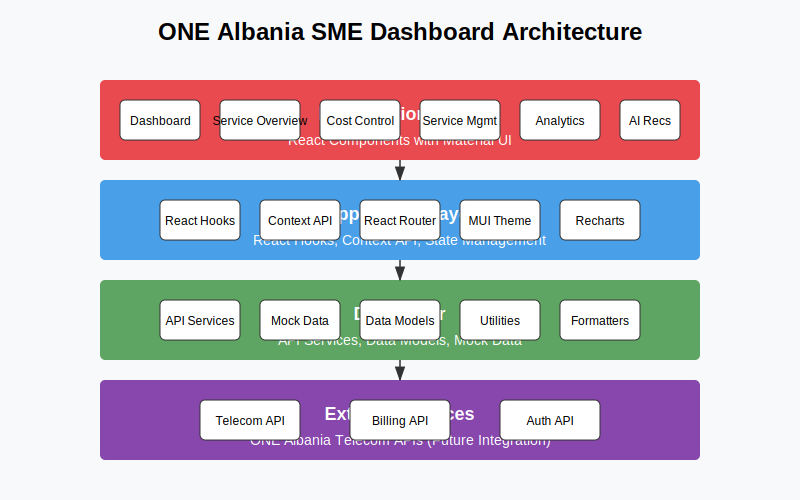

# ONE Albania SME Dashboard

<p align="center">
  
</p>

A smart dashboard solution for Small and Medium Enterprises (SMEs) to manage their telecom services with ONE Albania.

## 📋 Project Overview

This project is our submission for the ONE Albania challenge at the Junction Hackathon. We're building an intuitive SME dashboard that combines telecom service management, analytics, and smart business tools into a single interface.

### 🎯 Challenge Requirements

ONE Albania wants a unified, intelligent digital dashboard for SMEs that helps them:
- Monitor real-time usage and billing
- Optimize telecom spending
- Access and control services instantly
- Get AI-powered recommendations for better plans

## 🚀 Quick Start

### Prerequisites
- Node.js (v14 or higher)
- MySQL (v8 or higher)
- npm or yarn

### Installation

1. Clone the repository
```bash
git clone https://github.com/your-username/one-albania-sme-dashboard.git
cd one-albania-sme-dashboard
```

2. Install dependencies
```bash
# Install backend dependencies
cd server
npm install

# Install frontend dependencies
cd ..
npm install
```

3. Set up environment variables
```bash
# In the server directory, create a .env file with the following variables
PORT=5000
DB_HOST=localhost
DB_USER=root
DB_PASSWORD=your_password
DB_NAME=one_albania_db
JWT_SECRET=your_jwt_secret
JWT_EXPIRATION=24h
```

4. Initialize the database
```bash
cd server
npm run init-db
```

5. Start the development servers
```bash
# Start backend server
cd server
npm run dev

# In a new terminal, start frontend server
cd ..
npm start
```

## 📊 Features

### Service Overview
View and manage all telecom lines and services in one place.

### Cost Control
Monitor and optimize telecom spending with budget tools and alerts.

### Usage Analytics
Visualize usage trends and identify optimization opportunities.

### AI Recommendations
Get personalized suggestions to optimize services and reduce costs.

## 🛠️ Technology Stack

### Frontend
- **Framework**: React with Vite
- **UI Library**: Material UI
- **State Management**: React Context API
- **Charts & Visualization**: Recharts
- **Routing**: React Router

### Backend
- **Runtime**: Node.js
- **Framework**: Express.js
- **Database**: MySQL
- **Authentication**: JWT
- **API Documentation**: Swagger/OpenAPI
- **Testing**: Jest & Supertest

## 🧠 Architecture

Our application follows a modern frontend architecture:



## 👥 Team Members

- **Elvi Zekaj** - Frontend Developer
- **Aldin Zendeli** - UI/UX Designer
- **Guido Andreini** - Backend Developer
- **Lorenzo Agnello** - Project Manager

## 📝 Development

For development guidelines, see [HACKATHON_GUIDE.md](HACKATHON_GUIDE.md).

### API Documentation

API documentation is available at `/api-docs` when the server is running. It provides detailed information about all available endpoints, request/response formats, and authentication requirements.

### Testing

```bash
# Run backend tests
cd server
npm test

# Run test coverage
cd server
npm run test:coverage
```

## 🔄 Git Workflow

For Git workflow guidelines, see [GIT_WORKFLOW.md](GIT_WORKFLOW.md).

## 🏆 Judging Criteria Focus

- **Innovative Ideas**: Unique features that add business value
- **System Design**: Clean architecture and code organization
- **Core Functionality**: Implementation of required features
- **UI/UX**: User-friendly interface and experience
- **Teamwork**: Collaborative development process

## 📄 License

This project is licensed under the MIT License - see the [LICENSE](LICENSE) file for details.
